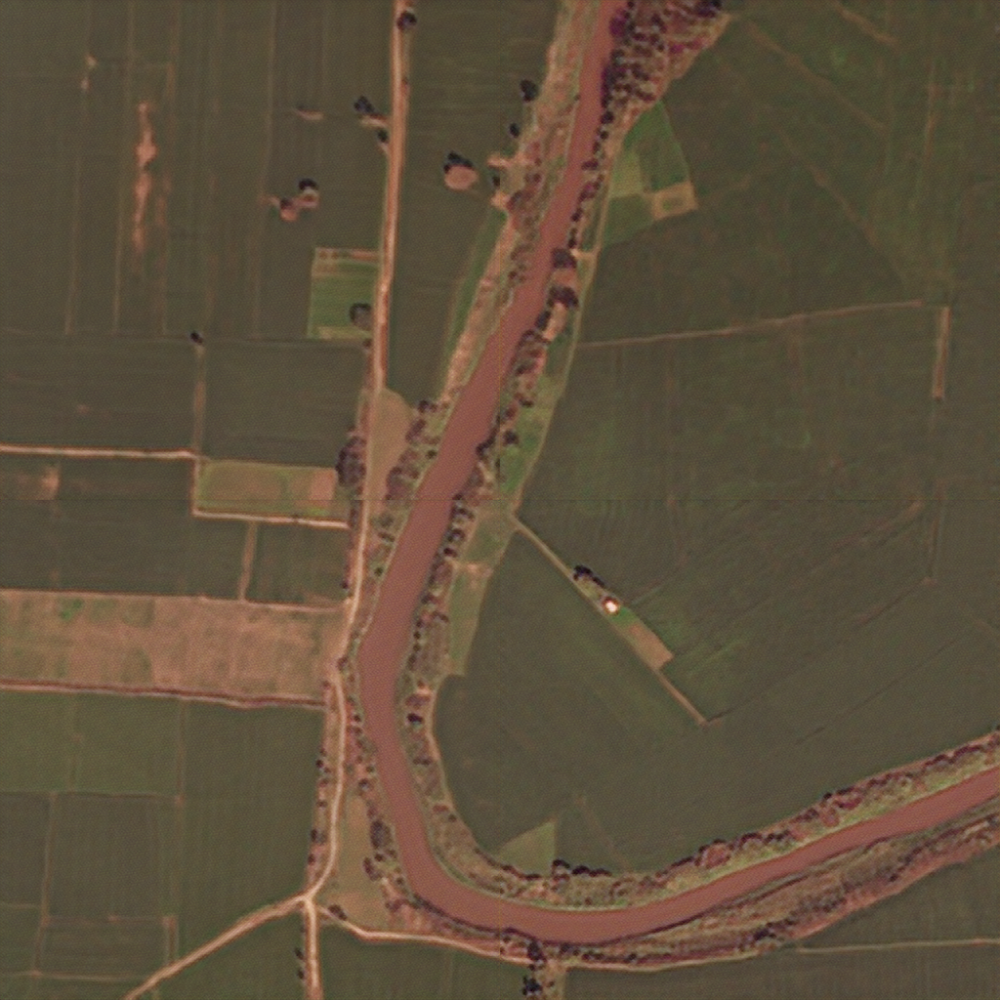
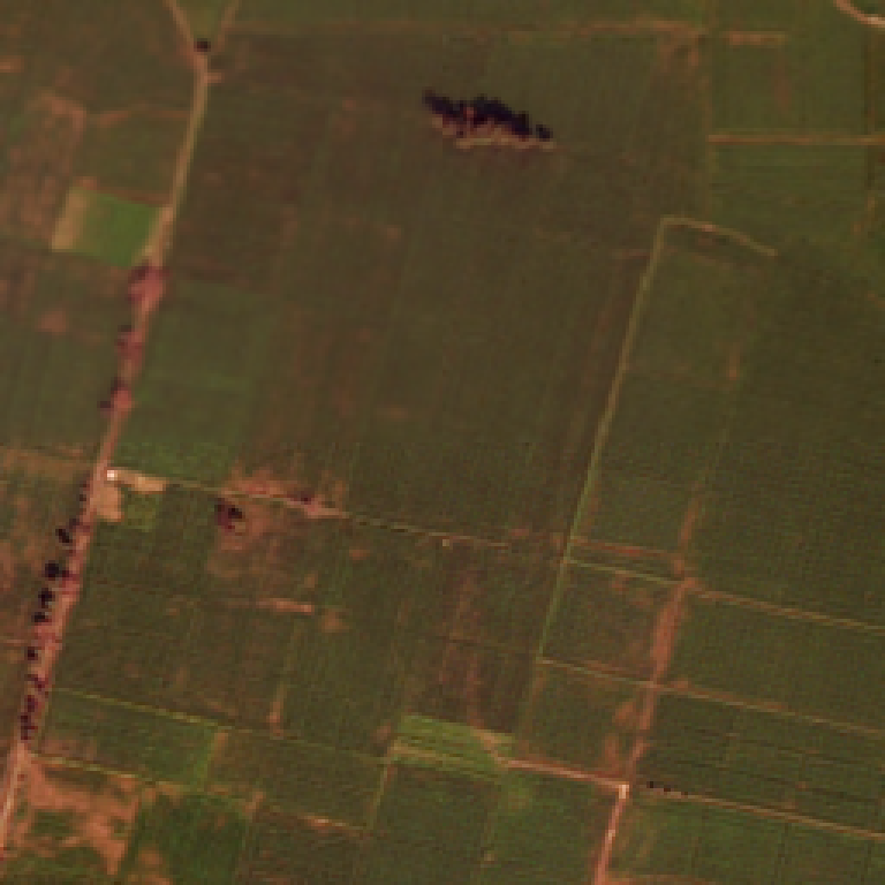
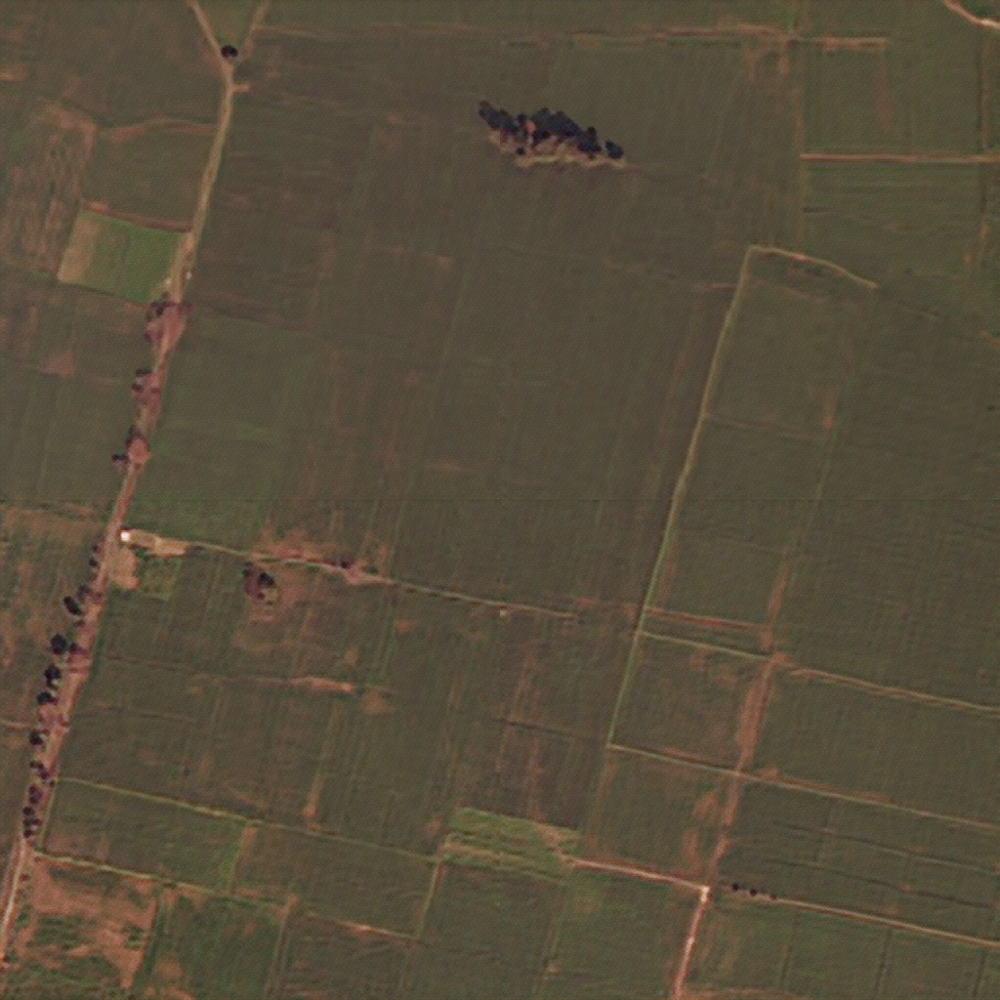
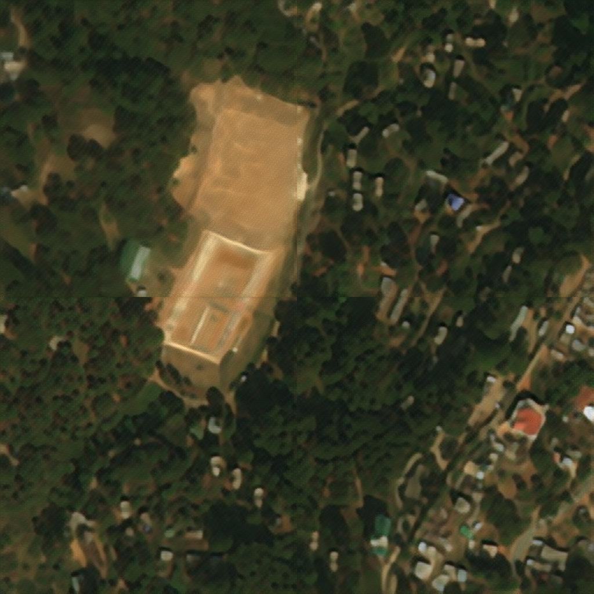
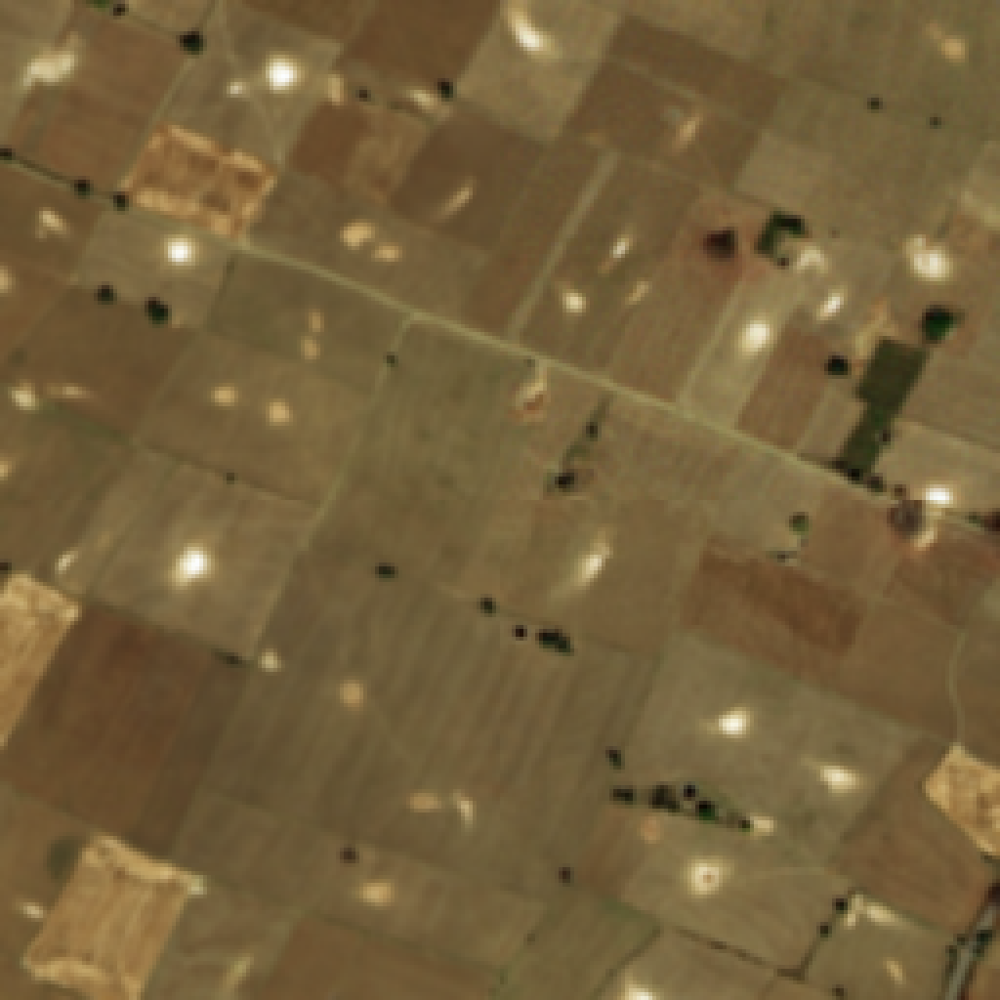
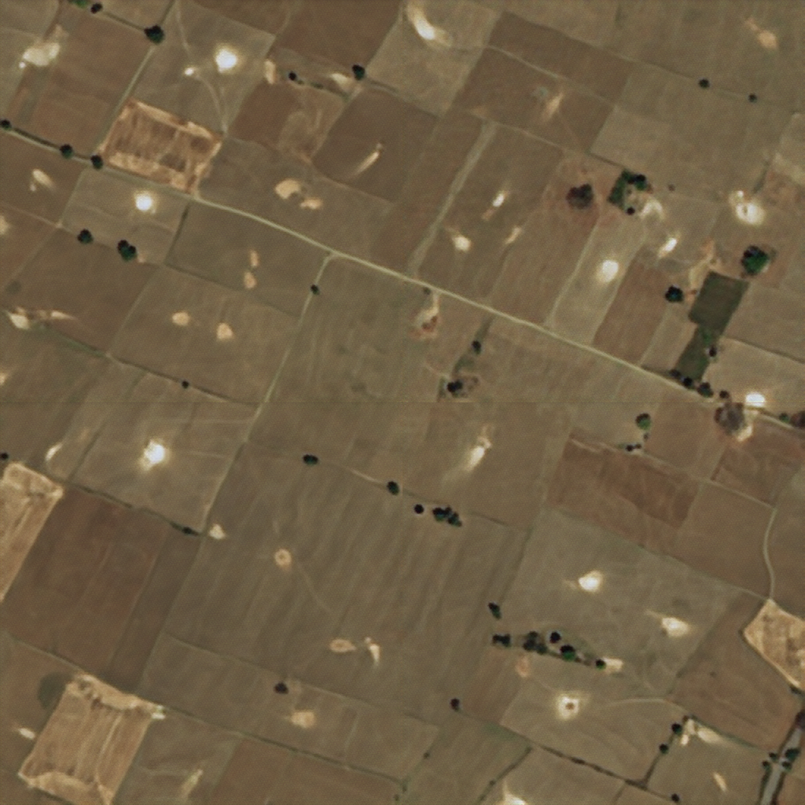
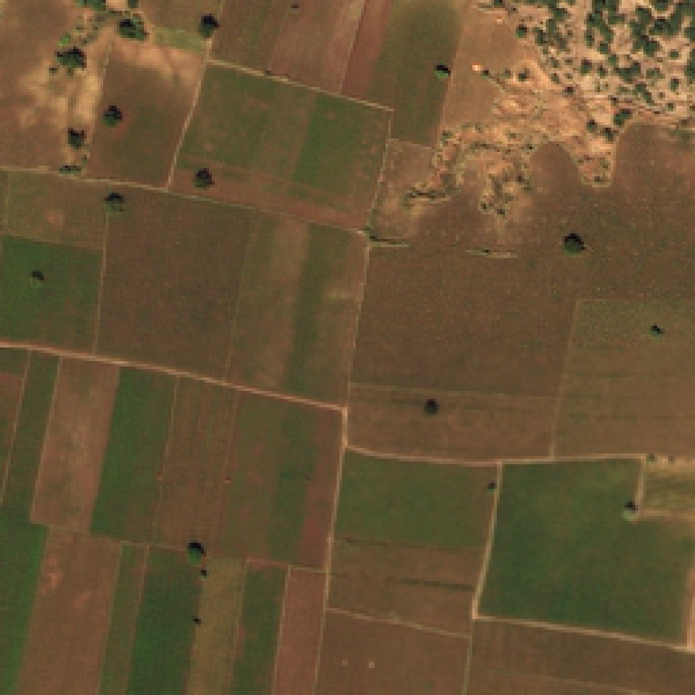
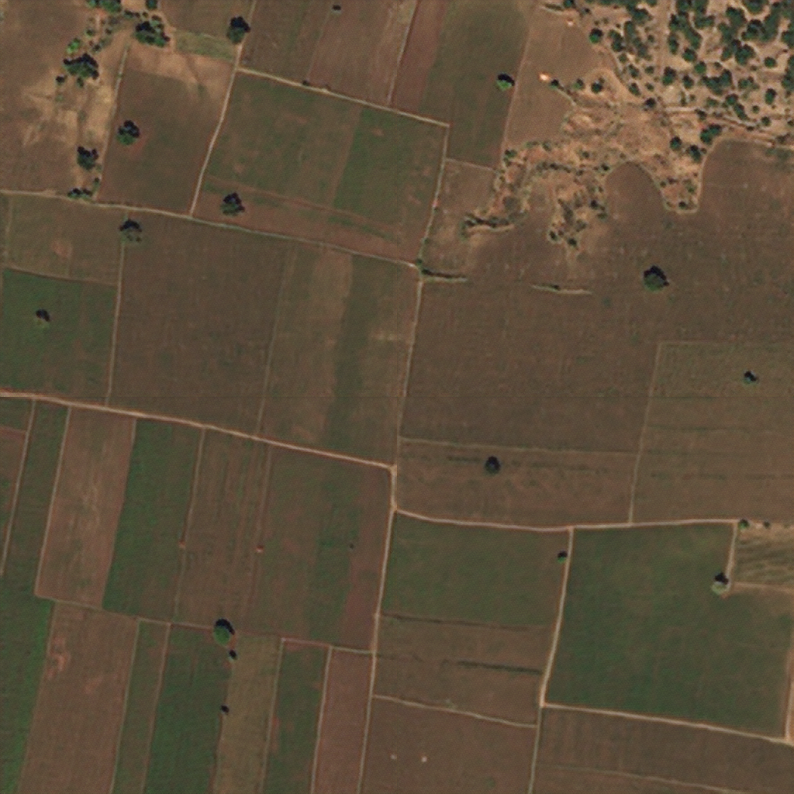

# Real-ESRGAN

## Abstract
&emsp; You can use this [Real-ESRGAN] to train and test yourself.
This repository is a simple rewrite of the official Real-ESRGAN with as little performance degradation as possible.
The code presented in this repository can perform super-resolution on variety of noises as well as the official Real-ESRGAN.
In other words, super-resolution can be performed not only on low-resolution images compressed by "bicubic", but also on images compressed by "area" and "bilinear".
In addition, super-resolution can be performed on images to which a Gaussian filter is applied.
This function is achieved by learning on low-resolution images with various noises applied.
The generators, discriminators, and loss functions are exactly the same as in the official Real-ESRGAN, allowing for a more sophisticated super-resolution experience.

### default settings  
- learning rate : 0.0001
- epochs : 20
- image size : 1024x1024

### training  
- esrgan.py  

### test <by>
- esrgan_test.py  
&emsp; Perform super-resolution on low-resolution images with various random noises applied. 
Five test images were prepared. 
Each of these five images was divided into four parts, and different noises were applied to the upper left, upper right, lower left, and lower right.
 
### Results  
<table>
   <tr>
    <td></td>
    <td></td>
   </tr>
   <tr>
    <td align="center">input</td>
    <td align="center">output</td>
   </tr>
  <tr>
    <td></td>
    <td></td>
   </tr>
   <tr>
    <td align="center">input</td>
    <td align="center">output</td>  
   </tr>
   <tr>
    <td></td>
    <td></td>
   </tr>
   <tr>
    <td align="center">input</td>
    <td align="center">output</td>
   </tr>
   <tr>
    <td></td>
    <td></td>
   </tr>
   <tr>
    <td align="center">input</td>
    <td align="center">output</td>
   </tr>
   <tr>
    <td></td>
    <td></td>
   </tr>
   <tr>
    <td align="center">input</td>
    <td align="center">output</td>
   </tr>
  </table>

## Dataset Preparation  
dataset : https://www.kaggle.com/balraj98/deepglobe-road-extraction-dataset?select=train  
&nbsp; recommendation  
&emsp; image-size : 1024x1024  
&emsp; number of images : 1000  

## Reference  
 github  
 &emsp; https://github.com/xinntao/Real-ESRGAN  
 paper  
 &emsp; https://arxiv.org/abs/2107.10833  
